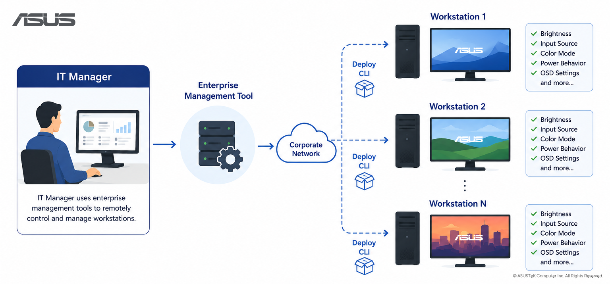

> 🌐 **Idioma**: [English](./README.md) · [繁體中文](./README.zh-TW.md) · [简体中文](./README.zh-CN.md) · [日本語](./README.ja.md) · [한국어](./README.ko.md) · **Español**

# 🖥️ ASUS Display Control

ASUS Display Control proporciona herramientas para consultar y configurar los ajustes de los monitores ASUS.
Este repositorio incluye actualmente una herramienta [CLI](#-cli-inicio-rápido) para scripting y automatización, y un AI [Agent Skill](#-ai-agent-skill) para el control del monitor mediante lenguaje natural.

Para usuarios que prefieren una interfaz gráfica (GUI), [ASUS DisplayWidget Center](https://www.asus.com/content/monitor-software-osd-displaywidgetcenter/) está disponible en el sitio oficial de ASUS.

## 📋 Descripción General

| Usuarios objetivo | Solución | Funcionalidades |
|---|---|---|
| Administradores de TI empresarial | [CLI](#-cli-inicio-rápido) + herramientas de TI | Scripts remotos, implementación, auditoría y configuración estandarizada de monitores en estaciones de trabajo corporativas. |
| Desarrolladores | [CLI](#-cli-inicio-rápido) + Scripts | Automatización del control del monitor desde el Símbolo del sistema, PowerShell o scripts. |
| Usuarios de AI Agent | [CLI](#-cli-inicio-rápido) + [Agent Skill](#-ai-agent-skill) | Control del monitor mediante lenguaje natural a través de un asistente de IA. |

## 🏢 Gestión de TI Empresarial

Use ASUS Display Control CLI para la gestión remota de TI y la configuración estandarizada de monitores en estaciones de trabajo corporativas.

### Casos de uso típicos

- Configurar el brillo, los preajustes de color, la fuente de entrada, el comportamiento de energía o los ajustes relacionados con el OSD.
- Ejecutar scripts de inicio, tareas programadas o flujos de trabajo de gestión empresarial.
- Auditar los ajustes y las capacidades del monitor para inventario, cumplimiento normativo o resolución de problemas.
- Estandarizar las configuraciones de monitores en nuevas implementaciones, dispositivos de reemplazo o departamentos completos.

### Implementación Empresarial

- Para implementaciones a gran escala, ASUS Display Control CLI puede distribuirse y ejecutarse a través de la infraestructura de gestión de endpoints empresariales existente, como Microsoft Intune, Microsoft Configuration Manager (SCCM), PowerShell Remoting, SSH u otras herramientas de gestión empresarial similares.
- Tenga en cuenta que ASUS Display Control CLI proporciona control de monitor local únicamente en estaciones de trabajo individuales.

## 🚀 CLI Inicio Rápido

### Descarga de CLI

| Plataforma | Descarga | Ejecutable |
| --- | --- | --- |
| Windows | [dwc_win.zip](https://github.com/ASUS-Display/asus-display-control/raw/main/cli/windows/dwc_win.zip) | `dwc.exe` |

### Instalación de CLI

Esto le permite ejecutar la CLI desde cualquier directorio sin especificar su ruta completa.
El script de instalación está incluido en la carpeta descomprimida.

| Plataforma | Script | Actualiza |
| --- | --- | --- |
| Windows | `install.bat` | `PATH` en las Variables de Entorno de Windows |

**Nota**: No mueva ni elimine la carpeta después de la instalación — la CLI dejará de funcionar si la carpeta se mueve o se elimina.

### Comandos de CLI

Abra el **Símbolo del sistema** (Windows) e intente:

| Comando | Descripción |
| --- | --- |
| `dwc.exe help` | Mostrar comandos disponibles y sintaxis |
| `dwc.exe list` | Listar todos los monitores ASUS conectados |
| `dwc.exe info` | Mostrar información detallada de los monitores conectados |
| `dwc.exe get brightness` | Leer el valor de brillo actual |
| `dwc.exe set brightness 60` | Establecer el brillo en 60 |

Para la sintaxis de comandos, propiedades compatibles y ejemplos, consulte [CLI_REFERENCE.md](CLI_REFERENCE.md).

## 🤖 AI Agent Skill

Use el Agent Skill cuando quiera que un asistente de IA controle un monitor en su lugar en vez de escribir comandos manualmente.

Solicitudes de ejemplo:

- 💬 "Baja el brillo del monitor 2."
- 💬 "Muéstrame la fuente de entrada actual."
- 💬 "Establece el brillo de todos los monitores en 50."
- 💬 "Comprueba qué ajustes admite este monitor."

El Agent Skill está disponible en [skills/asus-display-control/SKILL.md](skills/asus-display-control/SKILL.md). Cópielo o referencíelo desde un agente compatible que admita archivos de habilidades locales o instrucciones Markdown personalizadas y pueda ejecutar comandos de shell.

### Agentes Compatibles

- ✅ Cualquier agente que admita archivos de habilidades Markdown personalizados y la ejecución de comandos de shell.

## ⚙️ Requisitos

- Windows 10/11.
- Un monitor ASUS con compatibilidad DDC/CI.
- DDC/CI habilitado en el menú OSD del monitor.
- Una conexión de pantalla que transmita DDC/CI, como DisplayPort o HDMI.

## 📚 Documentación

- [Referencia de CLI](CLI_REFERENCE.md)
- [AI Agent Skill](skills/asus-display-control/SKILL.md)
- [ASUS DisplayWidget Center](https://www.asus.com/content/monitor-software-osd-displaywidgetcenter/)

## 📄 Licencia

Con licencia bajo Apache License 2.0. Consulte [LICENSE](LICENSE) para obtener más detalles.
