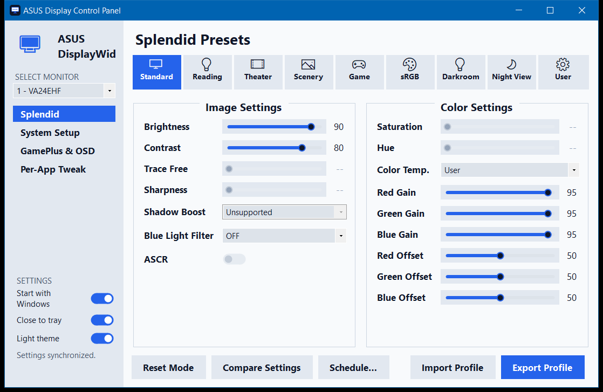
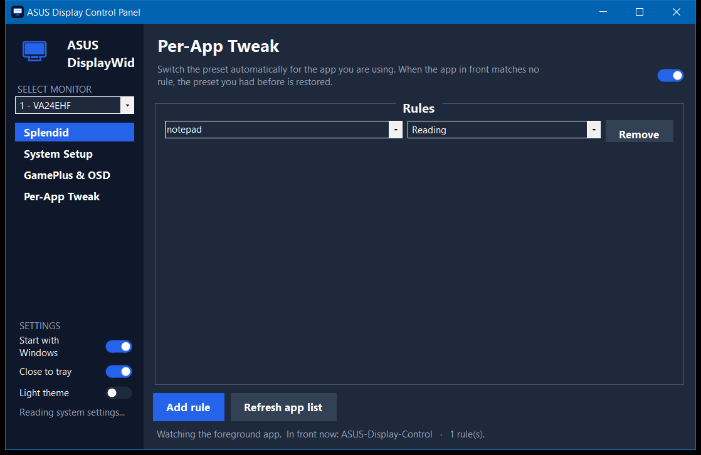

# 🖥️ ASUS Display Control (GUI fork)


A small, fast, native Windows app for ASUS monitors: Splendid presets, picture and colour
controls, the monitor's system/OSD settings, per-app and scheduled preset switching, and a
tray icon — in about 1.3 MB.

This is a fork of [ASUS-Display/asus-display-control](https://github.com/ASUS-Display/asus-display-control),
which ships a command-line tool (`dwc.exe`). This fork wraps that CLI in a lightweight
WinForms GUI so you get a real control panel without ASUS DisplayWidget Center
(~107 MB installed, ~60 MB RAM). The app is ~1.3 MB and idles around ~14 MB of RAM.


<details>
<summary>Light theme &amp; Per-App Tweak</summary>




</details>

## ✨ Features

The sidebar switches between four pages.

### Splendid

- **Presets** — Standard, Reading, Theater, Scenery, Game, sRGB, Darkroom, Night View,
  each with **per-preset memory**: tune a preset and your values come back whenever you
  return to it, with minimal switching flash.
- A **User** preset your monitor doesn't have. Splendid has no User slot, so this one is
  the app's: it sets a base Splendid mode and then applies the values you tuned into it.
- **Brightness, Contrast, Trace Free, Sharpness, Shadow Boost, Blue Light Filter, ASCR,
  Saturation, Hue, RGB gains, RGB offsets** and **Color Temp** — the temperature list is
  built from what the monitor advertises, not from a fixed table.
- **Compare** (press-and-hold to peek at the previous preset), **Reset Mode**, and
  **Import/Export** profiles.

### System Setup

Input source and auto input detect, OSD language / transparency / timeout, power saving,
power indicator, power-key and key locks, volume and mute, monitor information (model,
serial, firmware, usage hours), and the three resets — **mode**, **color**, **all**.

### GamePlus & OSD

FPS counter, timer, crosshair and display alignment, plus an **OSD remote**: a d-pad that
drives the monitor's own menu. That is the way to reach settings the CLI has no property
for — Rest Reminder, Color Augmentation, Aspect Control, Motion Sync, Adaptive-Sync,
QuickFit — without reaching behind the panel.

### Per-App Tweak

Map an app to a preset (Chrome → Reading, a game → Game). The app in the foreground picks
the preset; when nothing matches, the preset you had before is restored. Type a process
name or pick one from the list of running apps.

### Everywhere

- **Dark and light themes**, switched in the sidebar.
- **Scheduled preset switching** — *fixed times* (09:00 → Standard, 19:00 → Darkroom,
  wrapping past midnight) or *by daylight* (enter latitude/longitude; it follows
  sunrise/sunset).
- **System tray** icon, **close-to-tray**, and **Start with Windows**.
- Anything your monitor doesn't answer shows as *Unsupported* and is greyed out — see
  [What your monitor supports](#-what-your-monitor-supports).

## 🎚️ Presets, your values, and factory defaults

The app does **not** carry a table of factory defaults. It reads your monitor.

- The first time it sees a preset it snapshots that preset's current values into
  `dwc_presets.json`, and from then on it writes them back whenever you switch to it.
  So the values a preset "returns to" are the ones the monitor had when the app first
  met it — plus everything you changed since.
- Which values are per-preset is the monitor's business, not the app's. On a VA24EHF,
  for example, brightness and colour temperature really are per Splendid mode (Reading
  is dim and warm, Darkroom is dark, sRGB is fixed) while the RGB gains are one global
  set. Per-preset memory is what makes the gains *feel* per-preset.
- To get a preset back to the monitor's own defaults, use **Reset Mode** — it clears that
  preset's remembered values and asks the monitor to restore the mode. Note the monitor
  treats colour separately: `Reset Mode` leaves colour temperature and RGB gains alone,
  **Reset Color** is what restores those, and **Reset All** does everything (and clears
  all remembered presets).

## 🔍 What your monitor supports

Every ASUS panel answers a different subset of the CLI's properties, and the app only
enables what yours actually answers. A VA24EHF, for instance, answers brightness,
contrast, colour temperature, RGB gains and offsets, blue light filter, input source and
OSD language — but rejects Trace Free, Shadow Boost, ASCR, saturation, hue, sharpness,
GamePlus and the OSD/power/lock settings, even though some of them appear in its own
on-screen menu. Those rows show as *Unsupported*.

Reading a property the monitor rejects costs about a second on the DDC/CI bus, so the
System Setup and GamePlus pages probe lazily — once per monitor, the first time you open
them — and show *Reading…* until the answers arrive.

## ⚙️ Requirements

- Windows 10/11.
- An ASUS monitor with **DDC/CI** support, enabled in the monitor's OSD menu.
- A display connection that passes DDC/CI (DisplayPort or HDMI).
- The [.NET 8 Desktop Runtime](https://dotnet.microsoft.com/download/dotnet/8.0) for the
  default (tiny) build. Windows will prompt to install it if it's missing. The
  self-contained build bundles it and needs nothing extra.

## 📦 Install / build

Grab the latest [release](https://github.com/ctnkyaumt/asus-display-control/releases),
or build from source:

```powershell
powershell -ExecutionPolicy Bypass -File csharp/build.ps1     # framework-dependent (~1.3 MB)
# or:  csharp/build.ps1 -SelfContained                        # no .NET needed (~145 MB)
```

The app appears in `csharp/publish/`. Run `ASUS-Display-Control.exe`. See
[csharp/README.md](csharp/README.md) for developer/build notes and memory numbers.

## 💾 Where settings live

`%APPDATA%\ASUSDisplayControl\`:

| File | Holds |
|---|---|
| `dwc_settings.json` | Close-to-tray and light/dark theme |
| `dwc_presets.json` | Remembered values per preset (`100` is the User preset, `BaseSplendid` its base mode) |
| `dwc_schedule.json` | Scheduled preset switching |
| `dwc_apptweaks.json` | Per-App Tweak rules |

Deleting a file resets that part of the app; nothing else is written anywhere except the
`Start with Windows` entry under `HKCU\...\CurrentVersion\Run`.

## ⌨️ Command line (optional)

The underlying ASUS CLI (`dwc.exe`) is bundled with the app and can also be used on its
own for scripting:

```
dwc.exe list                 # list connected ASUS monitors
dwc.exe get brightness       # read a value
dwc.exe set brightness 60    # set a value
```

Full command and property list: [CLI_REFERENCE.md](CLI_REFERENCE.md).

## 📄 License & credits

Fork of [ASUS-Display/asus-display-control](https://github.com/ASUS-Display/asus-display-control).
Licensed under the Apache License, Version 2.0 — see [LICENSE](LICENSE).
