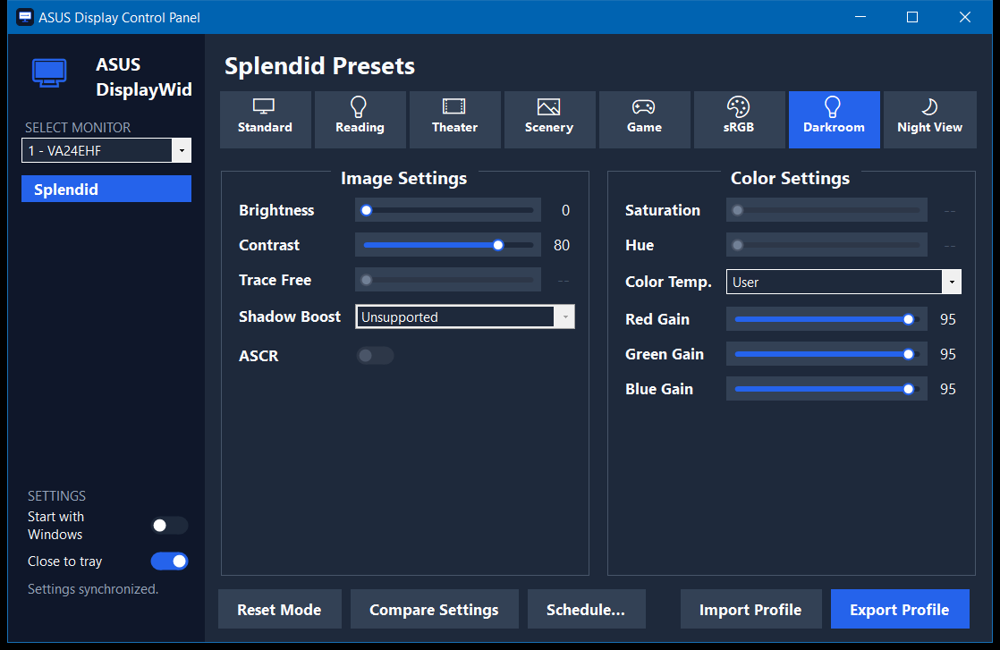

# 🖥️ ASUS Display Control (GUI fork)


A small, fast, native Windows app for controlling ASUS monitor settings — Splendid
presets, brightness/contrast/color, a system-tray icon, and automatic preset scheduling.

This is a fork of [ASUS-Display/asus-display-control](https://github.com/ASUS-Display/asus-display-control),
which ships a command-line tool (`dwc.exe`). This fork wraps that CLI in a lightweight
WinForms GUI so you get a real control panel without ASUS DisplayWidget Center
(~107 MB installed, ~60 MB RAM). The app is ~1.3 MB and idles around ~14 MB of RAM.



## ✨ Features

- **Splendid presets** (Standard, Reading, Theater, Scenery, Game, sRGB, Darkroom,
  Night View) with **per-preset memory** — tweak a preset's brightness/contrast/gains
  and they're restored whenever you return to it, with minimal switching flash.
- Live **Brightness, Contrast, Trace Free, Saturation, Hue, RGB gains, Shadow Boost,
  ASCR**, and **Color Temp** (only shows the values your monitor actually supports).
- **Compare** (press-and-hold to peek at the previous preset), **Reset**, and
  **Import/Export** profiles.
- **System tray** icon, **close-to-tray**, and **Start with Windows**.
- **Scheduled preset switching:**
  - *Fixed times* — e.g. 09:00 → Standard, 19:00 → Darkroom (wraps past midnight).
  - *By daylight* — enter your latitude/longitude and it switches between a day preset
    and a night preset at sunrise/sunset.

## ⚙️ Requirements

- Windows 10/11.
- An ASUS monitor with **DDC/CI** support, enabled in the monitor's OSD menu.
- A display connection that passes DDC/CI (DisplayPort or HDMI).
- The [.NET 8 Desktop Runtime](https://dotnet.microsoft.com/download/dotnet/8.0) for the
  default (tiny) build. Windows will prompt to install it if it's missing. The
  self-contained build bundles it and needs nothing extra.

## 📦 Install / build

Grab the latest [release](https://github.com/ctnkyaumt/asus-display-control/releases),
or build from source:

```powershell
powershell -ExecutionPolicy Bypass -File csharp/build.ps1     # framework-dependent (~1.3 MB)
# or:  csharp/build.ps1 -SelfContained                        # no .NET needed (~145 MB)
```

The app appears in `csharp/publish/`. Run `ASUS-Display-Control.exe`. See
[csharp/README.md](csharp/README.md) for developer/build notes and memory numbers.

## ⌨️ Command line (optional)

The underlying ASUS CLI (`dwc.exe`) is bundled with the app and can also be used on its
own for scripting:

```
dwc.exe list                 # list connected ASUS monitors
dwc.exe get brightness       # read a value
dwc.exe set brightness 60    # set a value
```

Full command and property list: [CLI_REFERENCE.md](CLI_REFERENCE.md).

## 📄 License & credits

Fork of [ASUS-Display/asus-display-control](https://github.com/ASUS-Display/asus-display-control).
Licensed under the Apache License, Version 2.0 — see [LICENSE](LICENSE).
